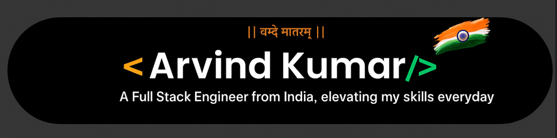

  

Hey everyone 👋, I am Arvind Kumar, a Master of Computer Applications (MCA) student at Vellore Institute of Technology (VIT), Vellore.
I am an inquisitive person with a deep curiosity about how technologies, tools, and systems around us work. This curiosity has consistently driven me to explore, learn, and grow — helping me understand concepts more deeply and adapt to new challenges quickly.

<h2 align="left">Connect with me 📞:</h2>

<kbd></kbd>
<kbd></kbd>

<kbd></kbd>

<h2 align="left">My Coding Profiles 👨‍💻:</h2>

<kbd></kbd>
<kbd></kbd>

<h2 align="left">Languages I Code In 🔥:</h2>

<kbd></kbd>
<kbd></kbd>
<kbd></kbd>
<kbd></kbd>

<h2 align="left">My Development Skills 🔥:</h2>

<kbd></kbd>
<kbd></kbd>
<kbd></kbd>
<kbd></kbd>
<kbd></kbd>
<kbd></kbd>
<kbd></kbd>

 

